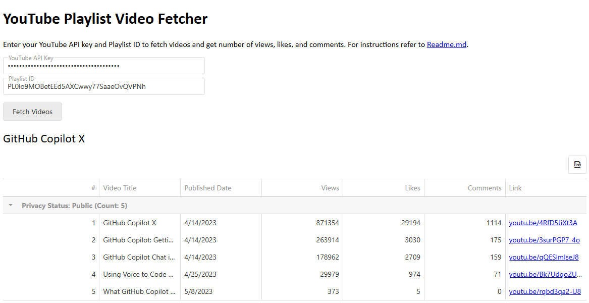

# YouTube Playlist Video Statistics Fetcher

This tool saves you effort when managing videos on YouTube: you can **fetch video statistics** from a given YouTube playlist and displays it in a structured data grid with just a few clicks. This app helps you get comprehensive statistics on each video in your playlist and analyze them all at once, which is especially useful for playlists with many videos.

[>> Open and try<<](https://natakazakova.github.io/fetch-youtube-playlist/)

## What tool can do

Key features: 

- Runs entirely in the browser—no backend services or installations are required.
- Displays a sortable, responsive data grid with results.
- Supports export to XLSX format for further analysis.

You get the following video statistics: 

- Video privacy
- Publish date
- View count
- Like count
- Comment count

## How to use

1. [Obtain your YouTube API key](https://developers.google.com/youtube/v3/getting-started#before-you-start).
2. Paste _YouTube API key_ and _Playlist ID_ to the corresponding textboxes.
4. Click **Fetch Videos** to get data.

## How it works

The web app background:

- [YouTube Data API v3](https://developers.google.com/youtube/v3/getting-started) to obtain video stats.
- [DevExtreme](https://js.devexpress.com/jQuery/) components for UI elements and a data grid with results.
- JavaScript, HTML, CSS

## Technical support
If you have any questions, write me to nata.kazakova@outlook.com.
